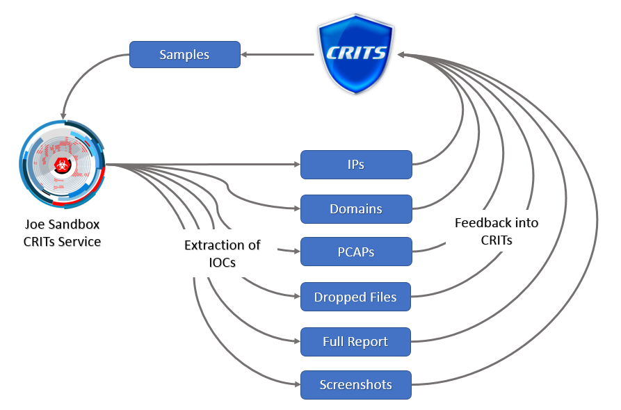
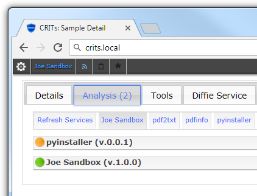

# Joe Sandbox CRITs

The Joe Sandbox CRITs service allows you to access the full power of Joe Sandbox
from inside [CRITs](https://crits.github.io/).

The service automatically extracts many IOCs from the sample and inserts them
automatically into CRITs enabling analysts to understand the connection between
multiple samples.

## Dependencies

The Joe Sandbox service requires the Python libraries specified in
requirements.txt and an on-premise installation or a cloud account for
Joe Sandbox.

https://www.joesecurity.org/

